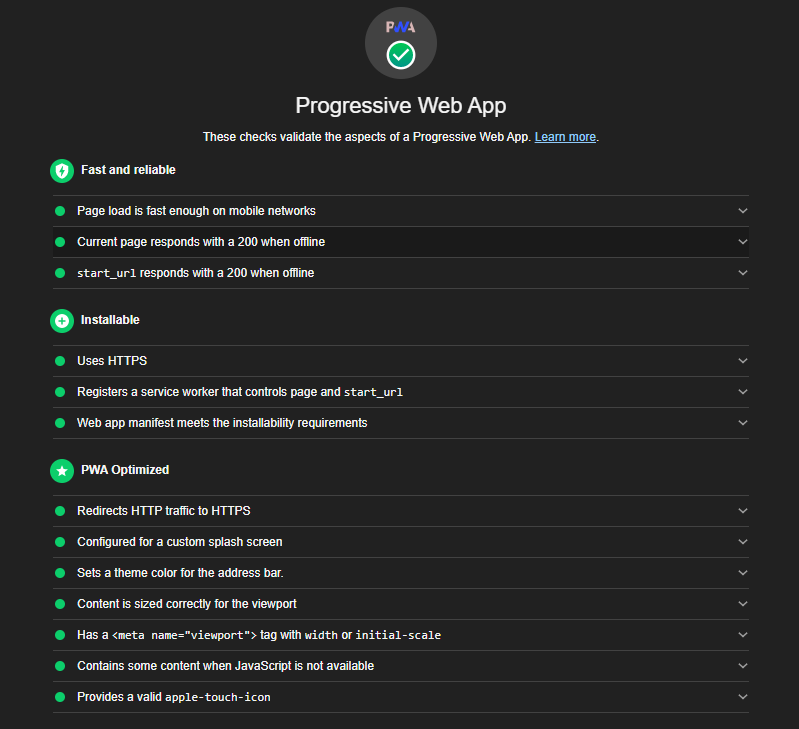

# Progressive Web App Example

Bare-naked "progressive web app" example with cache management.
Minimum requirements for https://developers.google.com/web/progressive-web-apps/checklist.
Tested by Chrome Developer Tools > Audits.

## Requirements
- Https connection (forced via .htaccess) 

## Based on 
- https://developers.google.com/web/fundamentals/primers/service-workers/
- https://www.sitepoint.com/getting-started-with-service-workers/
- https://codelabs.developers.google.com/codelabs/add-to-home-screen/#0

## Other references
- https://developers.google.com/web/fundamentals/app-install-banners/
- https://stackoverflow.com/questions/34369951/how-to-get-add-to-home-screen-pop-up-on-site-open-in-mobile-browser
- https://developers.google.com/web/fundamentals/primers/service-workers/
- https://developers.google.com/web/updates/2015/10/display-mode
- https://blog.betapage.co/how-to-add-add-to-homescreen-popup-in-web-app-99d5237fabff
- https://www.howtogeek.com/196087/how-to-add-websites-to-the-home-screen-on-any-smartphone-or-tablet/

## Copyright notice
Some block codes and comments are copy-pasted (adapted when needed) from the links above (all credits to original authors).
